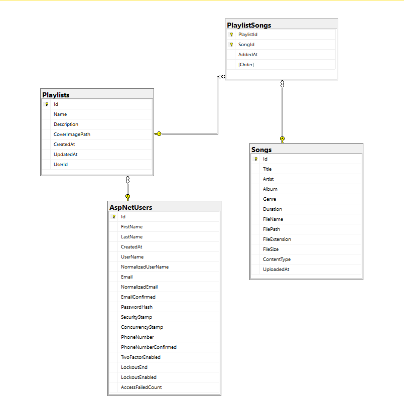

# SoundWave — Playlist Management System

A full-stack playlist management application: users create playlists and build them from a shared song catalog; admins manage that catalog. Built as a take-home assessment project.

- **Backend:** ASP.NET Core 10 Web API, 3-tier architecture (Controller → Service → Repository), EF Core Code First, SQL Server, ASP.NET Core Identity + JWT
- **Frontend:** Angular 21, standalone components, signals, Bootstrap 5 + custom CSS

---

## Table of Contents

- [Business Requirements](#business-requirements)
- [Tech Stack](#tech-stack)
- [Architecture](#architecture)
- [Database Documentation](#database-documentation)
- [Prerequisites](#prerequisites)
- [Getting Started](#getting-started)
- [Running the Project](#running-the-project)
- [Demo Accounts](#demo-accounts)
- [API Overview](#api-overview)
- [Running the Tests](#running-the-tests)
- [Screenshots](#screenshots)
- [AI Usage](#ai-usage)

---

## Business Requirements

**Core requirements:**
- A user should be able to create a playlist
- A user should be able to add songs to their playlist
- A user should be able to fetch their playlists

**Delivered beyond the core requirements:**
- Update and delete playlists
- **Duplicate playlist names are rejected** — a user can't have two playlists with the same name 
- **Optional cover image upload per playlist** — pick an image when creating/editing a playlist (`.jpg`/`.jpeg`/`.png`/`.webp`, max 5 MB); it's saved under `wwwroot/uploads/covers` and shown as the playlist's thumbnail everywhere for easier configurations
- A shared song catalog, browsable by anyone (public)
- Admin role that can upload, edit, and delete songs in the catalog (regular users cannot). Clicking a song row in the admin Catalog opens a modal to update its metadata, delete it, or play it directly in the audio player
- The audio player tracks a queue of whatever song list you were browsing, so **Next/Previous actually step through it**
- JWT authentication (register/login) with role-based authorization
- Real audio playback of uploaded tracks from a persistent bottom player
- Data Annotation validation matching between frontend and backend (identical rules, identical messages)
- Unit tests (service layer, mocked dependencies) and integration tests (full HTTP pipeline against a real SQLite database)
- Dockerized: one `docker compose up` runs SQL Server, the API, and the Angular app together, with named volumes for the database and uploaded files

---

## Tech Stack

### Backend — `backend/PlaylistManagement.Api`
| Concern | Choice |
|---|---|
| Framework | ASP.NET Core 10 Web API |
| ORM | Entity Framework Core (Code First, migrations) |
| Database | SQL Server |
| Auth | ASP.NET Core Identity + JWT Bearer tokens |
| API docs | Swashbuckle (Swagger UI) |
| Validation | Data Annotations (+ two custom attributes: `StrongPassword`, `AllowedExtensions`/`MaxFileSize` for uploads) |
| Testing | xUnit, Moq, FluentAssertions 7.x, `Microsoft.AspNetCore.Mvc.Testing` + SQLite in-memory for integration tests |

**Why SQL Server:** the project already targets a relational, strongly-typed schema (users, playlists, songs, and a many-to-many join with extra columns) with real foreign keys and cascade-delete rules — a natural fit for EF Core Code First against a relational engine, and SQL Server is the default first-class provider for .NET/EF Core tooling on Windows.

### Frontend — `frontend/`
| Concern | Choice |
|---|---|
| Framework | Angular 21 (standalone components, no NgModules) |
| State | Signals (`signal`, `computed`, `effect`) |
| Styling | Bootstrap 5 (grid/utilities only) + custom CSS built around a shared set of design tokens (`src/styles.css`) |
| Forms | Reactive Forms |
| HTTP | `HttpClient` + a functional interceptor for JWT attachment |
| Routing | Standalone lazy-loaded routes with functional guards |

---

## Architecture

### Backend — 3-tier
```
Controllers  → HTTP only: bind request, call a service, return a response. No business logic.
Services     → All business logic: ownership checks, validation beyond annotations, entity↔DTO mapping.
Repositories → Data access only: EF Core queries. No business rules.
```
Cross-cutting concerns:
- `Middleware/ExceptionHandlingMiddleware` — every response (success or failure) follows the same `{ success, message, data|errors }` envelope.
- `Validation/` — custom Data Annotation attributes (password strength, file type/size).
- `Data/DataSeeder` — seeds Identity roles and two development-only demo accounts on startup.

### Frontend — feature-based
```
core/       Singleton services, models (mirroring backend DTOs 1:1), guards, interceptor, validators.
layout/     Persistent app shell — sidebar, bottom audio player, modal/toast outlets.
shared/     Reusable, presentational-or-near-presentational components used by 2+ features
            (PlaylistCard, SongTable, ConfirmModal, PlaylistFormModal, SongPickerModal, Toast).
features/   Route-owning pages — one folder per screen (home, songs, playlists, catalog, auth, errors).
```
Route guards (`authGuard`, `adminGuard`) are functional guards; `adminGuard` decodes the JWT's role claim client-side, since the login response itself doesn't carry a separate roles field — only the token does.

---

## Database Documentation

Full documentation for this database is three things: the story below, an ERD, and a schema diagram. For the underlying ER concepts behind them (entities, attributes, cardinality, participation, notation) and how they were worked out from the story, see [`docs/database-documentation-guide.md`](docs/database-documentation-guide.md).

### The story

• Each user has one or many playlists — but each playlist belongs to exactly one user. 

• Each playlist has one or many songs, and each song can belong to one or many playlists - a many-to-many relationship.

• Each song belongs to exactly one shared catalog - songs are not owned by any single user or playlist. 

• Each playlist–song pairing carries its own data: the date the song was added to that playlist, and the song's 
order/position within that playlist. 

Songs live in a single shared catalog and are visible to every user. A user builds a playlist by selecting existing 
songs from that catalog and attaching them to their playlist - songs are not uploaded per playlist or per user. 
Because the same song can sit inside many different playlists at once, and a playlist obviously holds many songs, 
the relationship between Playlist and Song is many-to-many. A plain foreign key cannot represent this, so the 
relationship is implemented through a junction table, PlaylistSong, which resolves the many-to-many relationship  
Deleting a user deletes their playlists, since nothing else in the database references a user directly. Deleting a 
playlist only removes its song associations (its rows in PlaylistSong) - the songs themselves remain untouched in 
the catalog, since other users' playlists may still reference them. Likewise, deleting a song from the catalog only 
removes its associations from whatever playlists contained it; it does not delete those playlists. 


### Entity-Relationship Diagram (ERD)


### Schema Diagram



## Prerequisites


**running locally:**
- [.NET 10 SDK](https://dotnet.microsoft.com/download)
- SQL Server (a local instance, LocalDB, or a named instance — anything reachable from your connection string)
- [Node.js](https://nodejs.org/) 20+ and npm
- Angular CLI (`npm install -g @angular/cli`) — optional, `npx` works without a global install


---

## Getting Started

```bash
git clone https://github.com/Hazem-Ahmed1/playlist-manager.git
cd playlist-manager
```

---

## Running the Project

### 1. Backend

```bash
cd backend

# Restore the local dotnet-ef tool (used for migrations)
dotnet tool restore

# Run the API — applies pending migrations and seeds demo data automatically at startup
dotnet run --project PlaylistManagement.Api --launch-profile https
```

The API starts on `https://localhost:7019` (and `http://localhost:5074`). Swagger UI opens automatically at `/swagger`. Migrations apply themselves on startup, so there's no separate `dotnet ef database update` step to run first — though you can still run one manually if you'd rather create the database ahead of time.

> **Credentials you may need to change**, both in `PlaylistManagement.Api/appsettings.Development.json`:
>
> - **`ConnectionStrings:DefaultConnection`** — ships as `Server=localhost;Database=PlaylistManagementDb;Trusted_Connection=True;TrustServerCertificate=True;`. That works out of the box for a default local SQL Server instance; point `Server=` elsewhere if yours is different — e.g. `Server=(localdb)\mssqllocaldb;...` or `Server=YOUR-MACHINE-NAME;...` for a named instance. `Trusted_Connection=True` uses your current Windows login; switch to `User Id=...;Password=...;` instead if your instance uses SQL authentication.
> - **`Jwt:Key`** — ships with a working (but shared, and therefore insecure) 32+ character key so the project runs out of the box. Swap in your own local secret if you want tokens that are actually private to your machine. (`appsettings.json`, used outside the Development environment, instead ships a literal `REPLACE_WITH_A_LOCAL_DEV_SECRET...` placeholder — replace it with a real secret before running under any non-Development environment, since this file is committed to source control and its value is public.)

### 2. Frontend

```bash
cd frontend
npm install
npm start
```

The app serves at `http://localhost:4200`. `src/environments/environment.development.ts` already points at `https://localhost:7019/api` — update it if your backend runs on a different port.

> **CORS:** the backend's allowed origins are configured in `appsettings.json` under `Cors:AllowedOrigins`. `http://localhost:4200` is included by default; add your own port there if you serve the frontend elsewhere.

### 3. Try it out

1. Open `http://localhost:4200` — you'll see the song catalog (public) and a demo playlist card.
2. Click **Login** in the sidebar and use **Fill demo user** or **Fill demo admin** to auto-fill one of the seeded accounts, then submit.
3. As a regular user: create a playlist from the Home page or **My Playlists**, open it, and add songs via the search-enabled picker.
4. As the admin: open **Catalog Admin** in the sidebar to upload or delete songs.
5. Click any song row (catalog, playlist, or Home) to play it in the bottom audio player.

---

## Demo Accounts

Seeded automatically on backend startup, **development environment only** (see `Data/DataSeeder.cs`):

| Role | Email | Password |
|---|---|---|
| Admin | `admin@playlist.local` | `Admin@12345` |
| User | `user@playlist.local` | `User@12345` |

The login modal has one-click buttons to fill either set of credentials.

---

## API Overview

All endpoints are prefixed `/api`. Full interactive documentation (with request/response schemas) is available at `/swagger` once the backend is running.

| Method | Endpoint | Auth | Notes |
|---|---|---|---|
| POST | `/auth/register` | — | Creates a `User`-role account |
| POST | `/auth/login` | — | Returns a JWT |
| GET | `/songs` | — | Public catalog browse |
| GET | `/songs/{id}` | — | Public |
| POST | `/songs` | Admin | Multipart upload |
| PUT | `/songs/{id}` | Admin | Metadata only (title/artist/album/genre/duration) — no file |
| DELETE | `/songs/{id}` | Admin | Also deletes the audio file on disk |
| GET | `/playlists` | User | Current user's playlists |
| GET | `/playlists/{id}` | User (owner) | Includes songs |
| POST | `/playlists` | User | |
| PUT | `/playlists/{id}` | User (owner) | |
| DELETE | `/playlists/{id}` | User (owner) | |
| POST | `/playlists/{id}/cover` | User (owner) | Multipart cover image upload |
| POST | `/playlists/{id}/songs` | User (owner) | Attach an existing catalog song |
| DELETE | `/playlists/{id}/songs/{songId}` | User (owner) | |

Every response follows the same envelope:
```json
{ "success": true, "message": "...", "data": { } }
```
```json
{ "success": false, "message": "Validation Failed", "errors": [{ "field": "Name", "message": "Playlist name is required." }] }
```

---

## Running the Tests

```bash
cd backend
dotnet test PlaylistManagement.UnitTests
dotnet test PlaylistManagement.IntegrationTests
```

Unit tests mock every dependency (no database). Integration tests boot the real app via `WebApplicationFactory` against a SQLite in-memory database (schema created directly from the EF model, since the SQL Server migrations aren't SQLite-compatible), so they exercise the actual HTTP pipeline — routing, validation, JWT auth, and the exception middleware — end to end.

---

## Screenshots

| Home | Login | Register |
|---|---|---|
|  |  |  |

| My Playlists | Catalog Admin |
|---|---|
|  |  |

---

## AI Usage

Parts of this project (backend scaffolding, service/repository/controller implementation, tests, and the Angular frontend) were built with AI assistance (Claude, via Claude Code). Design decisions, validation rules, and architecture choices were reviewed and directed throughout the process rather than accepted as a single unreviewed generation.
