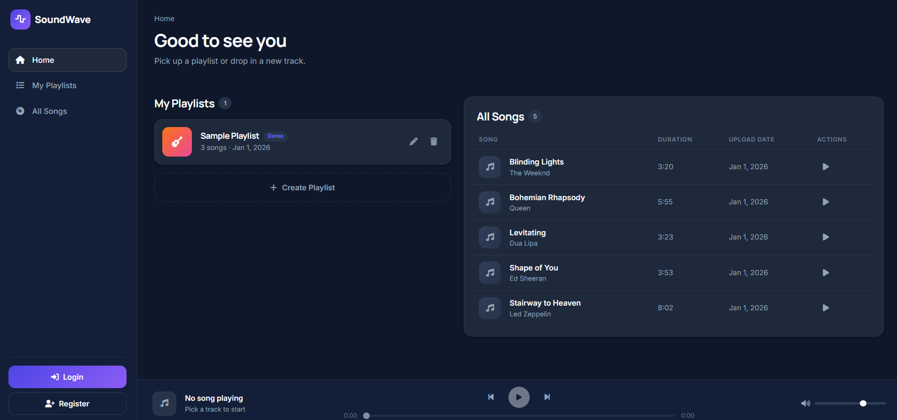
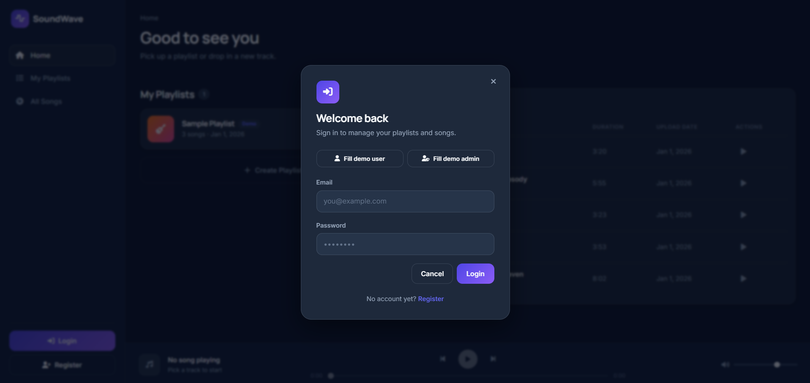
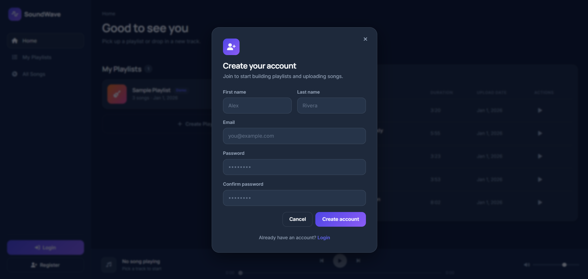
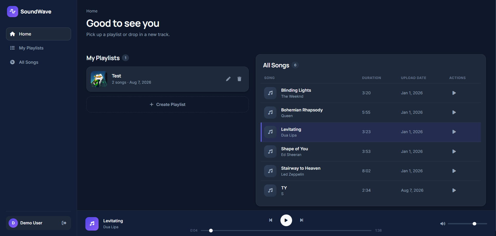
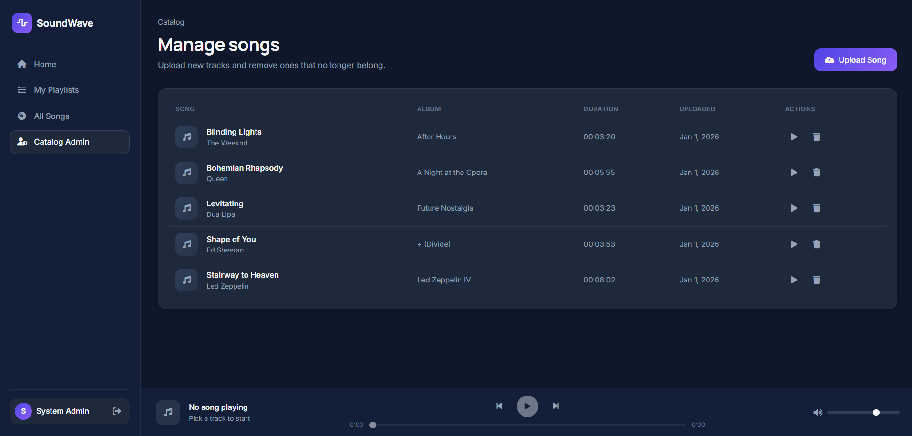

# SoundWave — Playlist Management System

A full-stack playlist management application: users create playlists and build them from a shared song catalog; admins manage that catalog. Built as a take-home assessment project.

- **Backend:** ASP.NET Core 10 Web API, 3-tier architecture (Controller → Service → Repository), EF Core Code First, SQL Server, ASP.NET Core Identity + JWT
- **Frontend:** Angular 21, standalone components, signals, Bootstrap 5 + custom CSS

---

## Table of Contents

- [Business Requirements](#business-requirements)
- [Tech Stack](#tech-stack)
- [Architecture](#architecture)
- [Project Structure](#project-structure)
- [Prerequisites](#prerequisites)
- [Running the Project](#running-the-project)
- [Demo Accounts](#demo-accounts)
- [API Overview](#api-overview)
- [Running the Tests](#running-the-tests)
- [Screenshots](#screenshots)
- [AI Usage](#ai-usage)

---

## Business Requirements

**Core requirements:**
- A user should be able to create a playlist
- A user should be able to add songs to their playlist
- A user should be able to fetch their playlists

**Delivered beyond the core requirements:**
- Update and delete playlists
- Remove songs from a playlist
- Cover image upload per playlist
- A shared song catalog, browsable by anyone (public), with a search-while-adding picker
- Admin role that can upload and delete songs in the catalog (regular users cannot)
- JWT authentication (register/login) with role-based authorization
- Real audio playback of uploaded tracks from a persistent bottom player
- Data Annotation validation matching between frontend and backend (identical rules, identical messages)
- Unit tests (service layer, mocked dependencies) and integration tests (full HTTP pipeline against a real SQLite database)

---

## Tech Stack

### Backend — `backend/PlaylistManagement.Api`
| Concern | Choice |
|---|---|
| Framework | ASP.NET Core 10 Web API |
| ORM | Entity Framework Core (Code First, migrations) |
| Database | SQL Server |
| Auth | ASP.NET Core Identity + JWT Bearer tokens |
| API docs | Swashbuckle (Swagger UI) |
| Validation | Data Annotations (+ two custom attributes: `StrongPassword`, `AllowedExtensions`/`MaxFileSize` for uploads) |
| Testing | xUnit, Moq, FluentAssertions 7.x, `Microsoft.AspNetCore.Mvc.Testing` + SQLite in-memory for integration tests |

**Why SQL Server:** the project already targets a relational, strongly-typed schema (users, playlists, songs, and a many-to-many join with extra columns) with real foreign keys and cascade-delete rules — a natural fit for EF Core Code First against a relational engine, and SQL Server is the default first-class provider for .NET/EF Core tooling on Windows.

### Frontend — `frontend/`
| Concern | Choice |
|---|---|
| Framework | Angular 21 (standalone components, no NgModules) |
| State | Signals (`signal`, `computed`, `effect`) |
| Styling | Bootstrap 5 (grid/utilities only) + custom CSS built around a shared set of design tokens (`src/styles.css`) |
| Forms | Reactive Forms |
| HTTP | `HttpClient` + a functional interceptor for JWT attachment |
| Routing | Standalone lazy-loaded routes with functional guards |

---

## Architecture

### Backend — 3-tier
```
Controllers  → HTTP only: bind request, call a service, return a response. No business logic.
Services     → All business logic: ownership checks, validation beyond annotations, entity↔DTO mapping.
Repositories → Data access only: EF Core queries. No business rules.
```
Cross-cutting concerns:
- `Middleware/ExceptionHandlingMiddleware` — every response (success or failure) follows the same `{ success, message, data|errors }` envelope.
- `Validation/` — custom Data Annotation attributes (password strength, file type/size).
- `Data/DataSeeder` — seeds Identity roles and two development-only demo accounts on startup.

### Frontend — feature-based
```
core/       Singleton services, models (mirroring backend DTOs 1:1), guards, interceptor, validators.
layout/     Persistent app shell — sidebar, bottom audio player, modal/toast outlets.
shared/     Reusable, presentational-or-near-presentational components used by 2+ features
            (PlaylistCard, SongTable, ConfirmModal, PlaylistFormModal, SongPickerModal, Toast).
features/   Route-owning pages — one folder per screen (home, songs, playlists, catalog, auth, errors).
```
Route guards (`authGuard`, `adminGuard`) are functional guards; `adminGuard` decodes the JWT's role claim client-side, since the login response itself doesn't carry a separate roles field — only the token does.

---

## Project Structure

```
playlist-manager/
├── backend/
│   ├── PlaylistManagement.Api/          # the API
│   │   ├── Controllers/
│   │   ├── Services/
│   │   ├── Repositories/
│   │   ├── Interfaces/
│   │   ├── Models/                      # entities + Options + Roles
│   │   ├── DTOs/
│   │   ├── Data/                        # DbContext, Fluent configurations, DataSeeder
│   │   ├── Migrations/
│   │   ├── Middleware/                  # exception handling + custom exceptions
│   │   ├── Validation/                  # custom Data Annotation attributes
│   │   └── wwwroot/uploads/             # song files + playlist cover images
│   ├── PlaylistManagement.UnitTests/
│   └── PlaylistManagement.IntegrationTests/
├── frontend/
│   └── src/app/
│       ├── core/                        # services, models, guards, interceptors, validators
│       ├── layout/                      # sidebar, audio player, app shell
│       ├── shared/                      # reusable components
│       └── features/                    # routed pages (home, songs, playlists, catalog, auth, errors)
└── docs/
    └── screenshots/                     # see Screenshots section
```

---

## Prerequisites

- [.NET 10 SDK](https://dotnet.microsoft.com/download)
- SQL Server (a local instance, LocalDB, or a named instance — anything reachable from your connection string)
- [Node.js](https://nodejs.org/) 20+ and npm
- Angular CLI (`npm install -g @angular/cli`) — optional, `npx` works without a global install

---

## Running the Project

### 1. Backend

```bash
cd backend

# Restore the local dotnet-ef tool (used for migrations)
dotnet tool restore

# Point the connection string at your SQL Server instance
# Edit PlaylistManagement.Api/appsettings.Development.json → ConnectionStrings:DefaultConnection

# Create the database and apply all migrations
dotnet ef database update --project PlaylistManagement.Api --startup-project PlaylistManagement.Api

# Run the API (also seeds Identity roles + demo accounts, see below)
dotnet run --project PlaylistManagement.Api --launch-profile https
```

The API starts on `https://localhost:7019` (and `http://localhost:5074`). Swagger UI opens automatically at `/swagger`.

> **JWT signing key:** `appsettings.Development.json` ships with a placeholder key. Replace `Jwt:Key` with your own local secret (32+ characters) — never commit a real production secret.

### 2. Frontend

```bash
cd frontend
npm install
npm start
```

The app serves at `http://localhost:4200`. `src/environments/environment.development.ts` already points at `https://localhost:7019/api` — update it if your backend runs on a different port.

> **CORS:** the backend's allowed origins are configured in `appsettings.json` under `Cors:AllowedOrigins`. `http://localhost:4200` is included by default; add your own port there if you serve the frontend elsewhere.

### 3. Try it out

1. Open `http://localhost:4200` — you'll see the song catalog (public) and a demo playlist card.
2. Click **Login** in the sidebar and use **Fill demo user** or **Fill demo admin** to auto-fill one of the seeded accounts, then submit.
3. As a regular user: create a playlist from the Home page or **My Playlists**, open it, and add songs via the search-enabled picker.
4. As the admin: open **Catalog Admin** in the sidebar to upload or delete songs.
5. Click any song row (catalog, playlist, or Home) to play it in the bottom audio player.

---

## Demo Accounts

Seeded automatically on backend startup, **development environment only** (see `Data/DataSeeder.cs`):

| Role | Email | Password |
|---|---|---|
| Admin | `admin@playlist.local` | `Admin@12345` |
| User | `user@playlist.local` | `User@12345` |

The login modal has one-click buttons to fill either set of credentials.

---

## API Overview

All endpoints are prefixed `/api`. Full interactive documentation (with request/response schemas) is available at `/swagger` once the backend is running.

| Method | Endpoint | Auth | Notes |
|---|---|---|---|
| POST | `/auth/register` | — | Creates a `User`-role account |
| POST | `/auth/login` | — | Returns a JWT |
| GET | `/songs` | — | Public catalog browse |
| GET | `/songs/{id}` | — | Public |
| POST | `/songs` | Admin | Multipart upload |
| DELETE | `/songs/{id}` | Admin | Also deletes the audio file on disk |
| GET | `/playlists` | User | Current user's playlists |
| GET | `/playlists/{id}` | User (owner) | Includes songs |
| POST | `/playlists` | User | |
| PUT | `/playlists/{id}` | User (owner) | |
| DELETE | `/playlists/{id}` | User (owner) | |
| POST | `/playlists/{id}/cover` | User (owner) | Multipart cover image upload |
| POST | `/playlists/{id}/songs` | User (owner) | Attach an existing catalog song |
| DELETE | `/playlists/{id}/songs/{songId}` | User (owner) | |

Every response follows the same envelope:
```json
{ "success": true, "message": "...", "data": { } }
```
```json
{ "success": false, "message": "Validation Failed", "errors": [{ "field": "Name", "message": "Playlist name is required." }] }
```

---

## Running the Tests

```bash
cd backend
dotnet test PlaylistManagement.UnitTests
dotnet test PlaylistManagement.IntegrationTests
```

Unit tests mock every dependency (no database). Integration tests boot the real app via `WebApplicationFactory` against a SQLite in-memory database (schema created directly from the EF model, since the SQL Server migrations aren't SQLite-compatible), so they exercise the actual HTTP pipeline — routing, validation, JWT auth, and the exception middleware — end to end.

---

## Screenshots

*(placeholders — screenshots to be added)*

| Home | Login | Register |
|---|---|---|
|  |  |  |

| My Playlists | Playlist Detail | Catalog Admin |
|---|---|---|
|  |  |  |

---

## AI Usage

Parts of this project (backend scaffolding, service/repository/controller implementation, tests, and the Angular frontend) were built with AI assistance (Claude, via Claude Code). Design decisions, validation rules, and architecture choices were reviewed and directed throughout the process rather than accepted as a single unreviewed generation.
